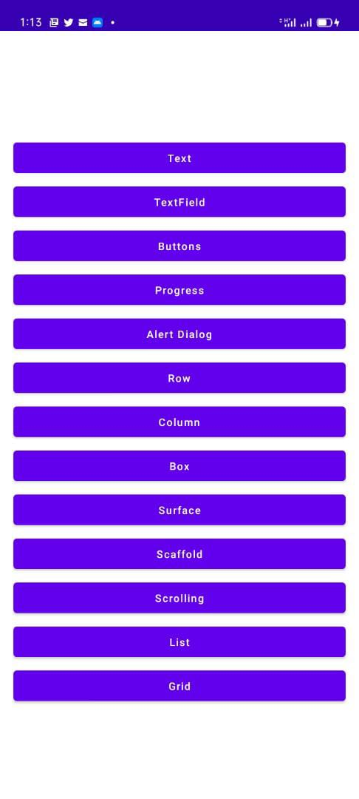

# jet-compose-basics 😜

A basic yet powerfull android application developed with jetpack compose "the awesome new UI toolkit for Android",
it demostrate the use of different jetpack compose ui components


### Status: 🚧 In progress 🚧

Most of the jetpack compose basic componets have been demostrated. However, i use this repo to for learning purposes, 
thus still under development 


### Download

If you want to clone the repo, open a terminal and type a git checkout command:

    git@github.com:mtali/jet-compose-basics.git

## Screenshots

<p align="">



</p>

## Features
The following UI components and concepts have beed used 
* Material Themes
* Text
* TextField
* Buttons
* Progress
* Alert Dialog
* Row
* Column
* Box
* Surface
* Scaffold
* Scrolling
* List
* Grid


## License

```
Copyright 2020 The Android Open Source Project

Licensed under the Apache License, Version 2.0 (the "License");
you may not use this file except in compliance with the License.
You may obtain a copy of the License at

    https://www.apache.org/licenses/LICENSE-2.0

Unless required by applicable law or agreed to in writing, software
distributed under the License is distributed on an "AS IS" BASIS,
WITHOUT WARRANTIES OR CONDITIONS OF ANY KIND, either express or implied.
See the License for the specific language governing permissions and
limitations under the License.
```
